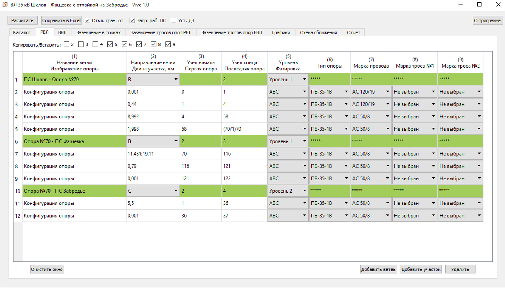

# Vive - calculating of a induct voltage

## Scope of application 
**Vive** - desktop application, designed for calculating induct voltage in overhead transmission power lines and automatically generation of special documentation in *.docx* format based on results of performed calculating.

## Table of contents

  1. [Description](#Description)
  2. [Used technologies](#Used-technologies)
  3. [Installation](#Installation)

## Description

Application's UI has been designed using a cross-platform UI framework [PyQt5](https://pypi.org/project/PyQt5/5.9/). This framework gives a rich functionality for UI designing, is easy to learn and has detailed documentation.

Initial data's input into the application is realized by filling of tables *QTableWidget* located into tabs *QTabWidget*. For mistakes finding in a entered data has been realized algorithm that in case of a mistake will show modal window with mistake's type and link to its locating.

Storage of a entered initial data is realized in database *sqlite3*, on the basis of which has been realized similarity of a file system, that provided convenience of a data storage, grouping and speed of access to it.

Visualization of a entered initial data is realized using library for work with images [Pillow](https://pypi.org/project/Pillow/8.1.1/) and algorithm which realizes drawing graphic primitives. Result of its work is different created images. These images allow easy to check correctness of entered a initial data and add them into generating documents.

One of main tasks of the application is calculating of induct voltage, which is realized by way of formation based on initial data system linear algebraic equations and its solve. More details about math model you can find in next [articles](https://disk.yandex.by/d/FrIEF12qER-tWQ?w=1). For solving this task are used math libraries [Numpy](https://pypi.org/project/numpy/1.15.0/) and [Scipy](https://pypi.org/project/scipy/1.5.4/) which have all needed tools for it. Since generating equation's systems usually consist from more 1000 equations and 70% of system's elements are null have been done next optimizations:

- Instead usual matrixes are used sparse matrixes *scipy.sparse*. This module has all needed tools for work with sparse matrixes and solver of equation's systems based on sparse matrixes. Using of sparse matrixes allows reduce volume of memory on matrixes' storage since it does not store null elements, and reduce time of solving equation's systems.
- Caching of calculating submatrices. Since matrix equation's systems are formed by way putting on it sets of submatrices, which calculating from integral expressions and are often identical to each other, caching these submatrices by input argument allows reduce spent of time on getting of equation's systems matrix.
- Caching by initial data. Initial data can split on different independent blocks, based on which are formed different independent submatrices of equation's system. Caching these submatrices by independent blocks of initial data allows not to do recalculation submatrices created from blocks of initial data which doesn't have changes. It allows instantly to get calculating's results in case absence of changes or accelerated calculating on account of need's absence to recalculate all submatrices. Data doesn't lose between sessions using of application on account of storing gotten submatrices in format files *.npy* and *.npz*, and links to its is serialized from *dict* into file by module *pickle*.

Data's part of calculating results is plots. For building of plots is used library [Matplotlib](https://pypi.org/project/matplotlib/2.2.2/) which has rich functional of building different and visual plots and has opportunity for adding it into UI. Also the library allow save built plots as images with different size and quality, that necessary for next introducing them into generating documents.

In order to initial data was more compact and it was easy to enter, it has links to sets of objects, params which are store in file *.xlsx* format. Files of this format easy to edit, that is conveniently in case need to do changes without knowledge about how the application works. For work with this files are used [Openpyxl](https://pypi.org/project/openpyxl/2.4.8/) library, which allows to read and write different information into this files. Also the library is used for gives the application users opportunity to get data for building of plots.

Besides implementation of calculating of induct voltage important task is generation special documentation *.docx* format. Necessity of generation documents *.docx* is explained convenience of next work with its, opportunity of editing and combining them in more difficult documents. For it is used [Python-docx](https://pypi.org/project/python-docx/0.8.6/) library, which allows to create these documents automatically, inserts into them images, creates tables and etc.

## Used technologies

- [Python 3.6.2](https://www.python.org/downloads/) - Python programming language interpreter.
- [Numpy 1.15.0](https://pypi.org/project/numpy/1.15.0/) - general-purpose array-processing package designed to efficiently manipulate large multi-dimensional arrays of arbitrary records without sacrificing too much speed for small multi-dimensional arrays.
- [Scipy 1.5.4](https://pypi.org/project/scipy/1.5.4/) - open-source software for mathematics, science, and engineering.
- [Matplotlib 2.2.2](https://pypi.org/project/matplotlib/2.2.2/) - library for interactive graphing, scientific publishing, user interface development and web application servers targeting multiple user interfaces and hardcopy output formats.
- [PyQt5 5.9](https://pypi.org/project/PyQt5/5.9/) - Python binding of the cross-platform GUI toolkit Qt, implemented as a Python plug-in.
- [Pillow 8.1.1](https://pypi.org/project/Pillow/8.1.1/) - the Python Imaging Library.
- [Openpyxl 2.4.8](https://pypi.org/project/openpyxl/2.4.8/) - Python library to read/write Excel 2010 xlsx/xlsm/xltx/xltm files.
- [Python-docx 0.8.6](https://pypi.org/project/python-docx/0.8.6/) - Python library for creating and updating Microsoft Word (.docx) files.

## Installation 

For using the application necessity to install components from section [Used technologies](#Used-technologies). First of all install Python interpreter, and after that using package manager *Pip* to install listed packages. In case using versions of packages that differ from the proposed, correct work of the application is not ensured.

        pip install -r requirements.txt

